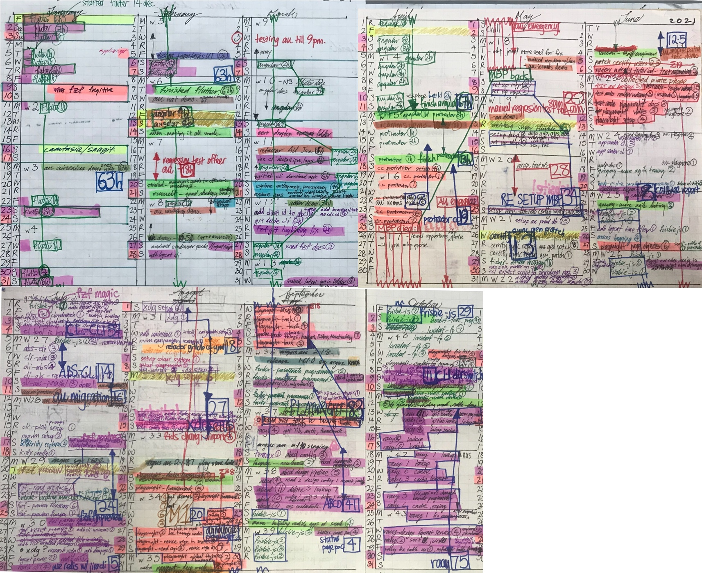

# Brag '21

## Where did all the time go? 🤔

<!-- ## Goals -->

<!-- **Infra** -->

<!-- 0. [ ] Build tooling to support developers - cli -->

<!-- **QA** -->

<!-- 1. [ ] QA - Set up Argus CC test automation -->
<!-- 2. [ ] QA - Set up api testing framework -->
<!-- 3. [ ] QA - Set up mobile test framework for Argus -->
<!-- 4. [ ] QA - Set up angular unit tests -->

<!-- **RM** -->

<!-- 5. [ ] RM - Automate release management -->
<!-- 6. [ ] RM - Automate release notes -->

<!-- **Deploy** -->

<!-- 7. [ ] Deploy - Introduce blue green deployments -->
<!-- 8. [ ] Deploy - Automate knox releases -->

<!-- **Ops** -->

<!-- 9. [ ] Ops - Set up canaries -->
<!-- 10. [ ] Ops - Set up status page -->

<!-- **Support** -->

<!-- 11. [ ] Support - Set up FR Reporting -->

<!-- **Others** -->

<!-- 12. [ ] Docs - Set up pretty user guides, knowledge base -->
<!-- 13. [ ] Scrum - Set up scrum dashboard - metrics -->

## Projects

### 0. abcd - dynamodb utility

The abcd tool can be used in future to migrate data across environments. This will be useful to migrate data from production to a test environment to provide realistic test data.
abcd will also help developers query and export data from dynamodb. This will help troubleshooting.

- September
  - Set up abcd cli framework - 40h
    - mvp can read locations table and print to stdout or export a json/csv file

### 1. cc test automation

- September
  - Set up playwright test automation framework - 110h so far this year
    - Reuse authentication state
    - Configuration layer
    - Sign in, task test structure

### 5. racy cli - RM tool

- August
  - set up api call with got
- October
  - announced racy, a release management cli tool ~10-28 Oct - 70h
    - use redis as cache
      - decide on cache key to use
      - set up expiry configuration
      - manage redis client connection/disconnection
      - use proxy to return a http client that optionally uses a cache depending on the passed in argv options or if cache configuration is present  
    - singleton
      - import config singleton directly instead of passing config through multiple layers
    - parallelize api calls
      - use pMap library to make hundreds of api calls
    - use factory to manage pagination from different services (gitlab vs jira)
    - use ramda to
      - curry builder function
      - dynamically access nested object property with configured path stored in yml
    - view layer
      - use yml config to set up table format
- November
  - show linked tickets - 1h
    - show linked jira or service desk tickets
  - edit tickets = 16h
    - accept multiple tickets - 2h
    - edit ticket fields = 14h
      - research jira ticket api - 3h
      - build request payload - 6h
        - fixVersion, labels, components 
        - accept Id or description for fixVersion, components
  - search across sprints - 2h
    - add a demultiplexer layer on top of the api module to make mulitple calls to the jira api
  - infra
    - use bfg to remove secrets from git log - 3h
  - docs
    - improve README, explain how to configure - 2h

## Side Projects

### 7. blue/green deploys

- September
  - Managed manual blue green deployment using Knox with users

### 10. status page

- September
  - set up status page POC

### i. Calltree

- June
  - created calltree report to report on campaign metrics

### ii. Certify Verify-Sync

- August
  - Refactored script to use XDG folder specification.
    - data folder - put db here
    - state folder - put s3 files here
    - cache folder - put temporary files here, eg report tmp, artifact files, downloaded cognito data
- November
  - certify-verify 
    - use fd--exec-batch to run rg on fd results - 2h
    - sqlite3 crud - 2h
    - whitelist commands feed off each other - 1h

----

## Responsibilities

### a. QA

I have been creating cli tools to make manual testing more painless. There is much drudgery in testing (or in life). For example, downloading the latest apk, installing it on the phone, uninstalling other apps on the phone, viewing the logcat output (on both android or ios), uploading an apk to app center, viewing a cloudwatch log, finding a cloudwatch log group to view 

Apart from removing the drudgery, I have also tried to set up UI testing for the Argus frontend

Experimentally, I have also tried creating a suite of cli scripts to exercise the argus backend. This has been useful in load testing. I created a thousand tasks with this suite and observed the behaviour of the frontend under load.

- March
  - Created iOS cli tool to print app debug output
- May
  - Created recurring job to generate certify patch and email to myself
- July
  - Created cloudwatch cli that accepts intuitive start and end time parameters for easier log filtering
    - use yargs library (cli framework)
- August
- September
  - Set up playwright test automation framework - 110h so far this year

### b. RM

I created racy to make release management easier. Racy displays the jira tickets in the sprint and also flags the ticket if it has an unexpected git status.

I am also interested in making visible ticket dependencies 

I have also made miscellaneous cli tools to edit tickets quickly, transition their status, show tickets in service desk

Why is racy important?
Release Management is slow. We are unsure of our dependencies. It is slow because documentation is done manually. We have to indicate the ticket's fix version and its component and then move the ticket along to done. Verification is also done manually to check if the ticket's code has been promoted to the correct git branch. The release notes are created manually.

<!-- Why is this important? -->

- March
  - Created cli for gitlab to download apk
- May
  - Created app center cli to manage release - download apk, publish release notes, publish app
- June
  - Set up Argus AU app in Google Play Store
- August
  - Created Jira cli tool
  - Refactored Argus CC Gitlab pipeline - 18h
  - Managed manual blue green deployment using Knox with users
- October
  - Created racy, a release management cli tool ~10-28 Oct - 70h
- November
  - service desk - (3h)
    - pagination - 1h
    - queues
      - get queues, queue issues - 2h
  - jira
    - transition tickets - accept stdin - 2h
    - project versions - (11h)
      - display, create, edit, delete - 7h
      - get issues - 4h
  - release notes
    - add cli for quick access and display
    - add cli to account for jira tickets in release against declared tickets in release notes e.g check if ticket is missing from release notes etc

### c. Monitoring

### d. On-Call & Incident Response

- August
  - Set up on-call workflow and rostering

### e. Support

I support SG and AU Operations. I hope to automate the generate of SG FR Metrics. Currently, it takes me 3 hours to create the FR report charts presented at the pre CCM meeting.

- July
  - Migrate AU locations from staging to production
- September
  - Set up a customer portal in Argus service desk where users can discuss and
      view each other's tickets
- October
  - Automated jira ticket creation from service desk
- November
  - cli - database
    - login attempts - display, filter, input, output, error handling
      - used generic jq script to convert json to csv

<!-- ### f. Lead QA Team -->

<!-- ### g. Scrum Mastering -->

<!-- ### h. Collaboration & Mentorship -->

### i. Design and Documentation

- January 
  - Contributed to winning the multimillion dollar AU air services tender by creating video demo for AU airservices tender - 63 hours
- February
  - Designed team tasks officer UI - 11hrs
- October
  - Wrote RFC to invite team to comment on proposed jira workflow improvements

### z. Tooling

- October
  - Automated mfa token entry for the aws cli - 4h
- September
  - Set up abcd cli framework - 40h

---

## What I've read/watched

- January
- February
  - Finished Udemy Flutter course - 78h
  - Read Good Strategy Bad Strategy by Rumelt
- March
- April
  - Finished Udemy Angular course - 68h
  - Finished Udemy Protractor course - 13h
- May
  - Read Staff Engineer by Will Larson
  - Read Super Thinking by Gabriel Weinberg
- June
  - Read More Agile Testing by Janet Gregory
- July
- August
  - Read Deep Work by Cal Newport
- September
  - Read Passionate Programmer by Chad Fowler
  - Read Accelerate by Nicole Forsgren
  - Read Building Mobile Apps at Scale by Gergely Orosz
- October
  - Read JavaScript for Web Developers by Matt Frisbie
  - Read Professor Frisby's Mostly Adequate Guide to Functional Programming by Brian Lonsdorf - 21h
    - difficult but enlightening to learn about a new mode of programming
  - Read Making Work Visible by Dominica DeGrandis - 5h

## Outside of work

Neovim, redis, colours, docusaurus website, logging deep hours, lazygit - autosquash, fixup

cli - eval, redis cache utility layer, rest api pagination utilities, xdg directories, authy OTP integration, tcl expect scripting

fzf - (command palette, directory switcher)

- June
  - Improved time tracking tool to take in calendar week parameter and a time range
  - Set up macos tagging to automatically move files from desktop to tagged folders
- July
  - Used GNU Parallel to parallelize API calls to Argus
  - Switched from Vim to Neovim
  - Use fzf auto suggest cli tool to power my workflows
    - Use fzf to list my shell functions - 19 hours
  - Set up Arch Linux on spare laptop
  - Use Vim Fugitive as daily Git driver
  - cli - cache recently edited files to quickly re-open in text editor
- August
  - Tried Redis
  - Reorganized home folder by using XDG specification
  - Reorganized folders in my ikea cabinet
  - Set up colour system to categorize my work
  - Used docusaurus to publish personal website
  - Set up Kanban board
  - Start logging deep work hours every day
- September
  - Installed termux on phone
  - Use lazygit cli to manage release
- October
  - Created cli fuzzy directory switcher - 11h
    - opens a fzf directory search, preview window displays text file or dir contents
    - yml configuration to define keymaps for different directories, with options
      - read yml configuration with yq 
      - process configuration with while read, which splits on newline
      - dynamically define functions with eval
    - command to show and edit configuration 
      - search configuration with fzf
    - good defaults - switch to parent directory if file chosen
    - cache any edited file in the nvim cache
  - added redis cache utility to my cli tools - 4h
    - rcache options cacheKey[.cacheExpiry] functionToCall [functionParam1 functionParam2 ... ]"
    - eg rcache jira/sprints.604800 _ras checks if there is any value stored in the cache under the jira/sprints key, if no cache value is found, the _ras function is called, stored in cache with an expiry of 604800 seconds (1 week) and returned to the caller.
    - supports a -r (reload) option to force a function call and a cache update
    - dynamically calls function with eval
    - handles exception if less than the expected number of args is passed
    - parses the <cacheKey[.cacheExpiry]> argument which optionally contains a period as a delimiter
- November
  - workflow 
    - lazygit
      - start using lazygit to fixup and auto squash commits
      - implement rebase and merge workflow
  - vim
    - set up terminal workflow with neoterm - 3h
    - refactored vim config, break up into vim files in plugin folder - 6h
      - use lua files as well
    - add neoterm plugins - 2h
      - lsp, treesitter, telescope
  - cli
    - jq - start using modules for colour, padding, conversion - 2h
    - global aliases
      - using global aliases as glue
        - eg T to access /tmp/t as 'register'
          - CT displays T, ET opens T, FT displays filename of T
          - use TT to refer to secondary register, eg /tmp/tt

last updated: 20 Nov 21, Sat
